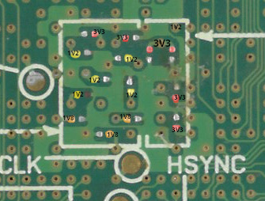

# DSi modchip installation

If you have properly followed the previous chapters, everything is now ready and
you can now proceed with installing the modchip on your console.

> [!CAUTION]
> ***WARNING***: you are entering the danger zone. Accidents with soldering can
> permanently brick your console. You have been warned.

## Soldering

### Opening your console

Please follow the iFixit guide ([DSi](https://www.ifixit.com/Guide/Nintendo+DSi+Motherboard+Replacement/3748),
[DSi XL](https://www.ifixit.com/Guide/Nintendo+DSi+XL+Motherboard+Replacement/3248))

### Soldering the modchip on the console

Please follow the modchip-dependend guide:

* [Purpose-built modchip](./install/haxboard.md)
* [Raspberry Pico](./install/pico.md)
* [Adafruit ItsyBitsy RP2040](./install/itsybitsy.md)
* [Seeed XIAO RP2040](./install/xiao.md)
* [WaveShare RP2040-Zero/Tiny](./install/waveshare.md)

### Soldering the glitching MOSFET

> [!CRITICAL]
> This is the difficult part. Do be really careful, don't set your soldering
> iron too hot, or you *will* brick your console.

Use the following pinout:

| Purpose-built modchip | Pico | ItsyBitsy | XIAO | WaveShare | Comment |
|:--------------------- |:---- |:--------- |:---- |:--------- |:------- |
| HAX                   | GP21 | GP25      | GP7  | GP14      | to glitch MOSFET gate |

1. Find the decoupling capacitors of the main SoC on the motherboard. These ar
   on the side of the testpoints, and look like this:
   
   On a DSi, this photo is taken at the same orientation as the text. On a DSi
   XL, this is rotated by 90 degrees.
2. Place the IRFHS8342 MOSFET close to these decoupling capacitors, upside-down
   (that is, with the metal pads/contacts pointing up). Glue the MOSFET in
   place, but do leave the metal contacts open to the air!
3. Connect the positive side of *one* **1V2** decoupling cap to the drain (D)
   of the MOSFET (c.f. [MOSFET datasheet with pinout](https://www.infineon.com/dgdl/Infineon-IRFHS8342-DataSheet-v01_01-EN.pdf?fileId=5546d462533600a401535623992e1f5f)).
   Use very thin enamel wire.
4. Connect the negative side of *the same decoupling cap* to the source (S) of
   the MOSFET. Use very thin enamel wire.
5. From the source (S) of the MOSFET, run a strand of enamel wire that is abou
   one or two cm in length, and roll up the loose end in a spiral form.
6. Fill the loose spiral end of the wire with drops of solder.
7. Connect the ground (GND) of the modchip/RP2040 to the drop of solder you
   just created.
   * When using a DIY modchip, use a ground pin as close to the HAX pin as
     possible.
8. Glue the drop of solder in place.
9. Repeat steps 5..8, but starting from the gate (G) of the MOSFET, and to the
   HAX pin of the modchip.
10. Cover everything with kapton tape for protection.

> [!TIP]
> A flex-cable assembly (that has the IRFHS8342 MOSFET soldered onto it) is
> planned, but not yet designed or fabricated. This will make the above much
> easier. Though, for now you'll have to do it the hard way, sorry.

## Glitch parameter training

> [!IMPORTANT]
> As the modchip firmware does not yet perform any automated glitch parameter
> training, this has to be done manually. (This feature is planned, but it's
> not there yet, sorry.)

1. Connect your USB-UART converter to the UART pin of your modchip, if it is
   not yet connected.
2. Turn on the console, and collect the output of the USB-UART converter.
3. Let it run, until the UART output of the modchip says it has stopped.
4. Looking at the output, try to find which combination of glitch offset and
   length resulted in the most glitches.
5. Enter this narrow parameter range in the code [here](https://github.com/dsi-modchip/firmware/blob/main/rp2040/src/twlitf/glitchitf.c#L26-L38).
6. Change [this](https://github.com/dsi-modchip/firmware/blob/main/rp2040/src/twlitf/boothax.c#L62) line of code:
   where it currently says `boothax_train`, change this to `boothax_attack`.
7. Recompile the firmware.
8. **Disconnect the modchip from your console.** (The glitching MOSFET wires
   can stay connected.)
9. Reflash the firmware on the modchip
10. Reconnect the modchip to the console, and disconnect the USB-UART converter
    from the modchip.

